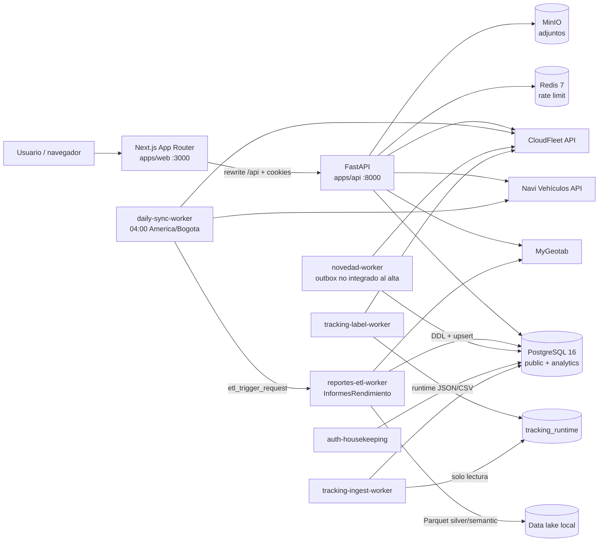
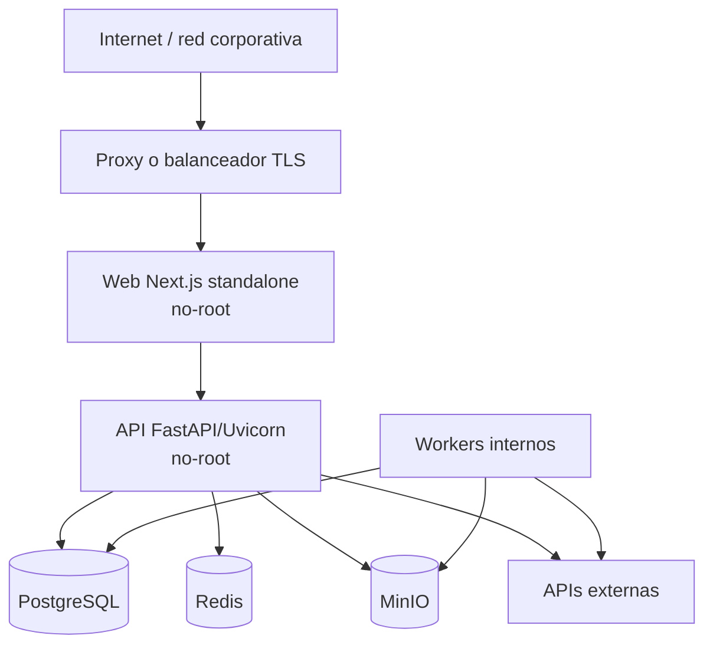

# Portal Clientes — arquitectura funcional, de solución y de datos

| Control             | Valor                                                                                      |
| ------------------- | ------------------------------------------------------------------------------------------ |
| Estado              | Borrador técnico para revisión de Arquitectura TIC                                         |
| Versión documental  | 1.1                                                                                        |
| Corte de inspección | 2026-08-28                                                                                 |
| Producto            | Portal Clientes                                                                            |
| Alcance técnico     | Web, API, workers, integraciones, datos, runtime y evolución prevista                      |
| Clasificación       | Uso interno; no contiene secretos, valores de `.env`, datos personales ni datos de negocio |

Este documento distingue tres estados para evitar que una capacidad planeada se
interprete como una garantía vigente:

- **Implementado y activo:** existe en código y participa en el runtime descrito.
- **Implementado y deshabilitado:** existe de extremo a extremo, pero la
  configuración de despliegue lo excluye.
- **Propuesto:** es una decisión o evolución pendiente; todavía no forma parte
  del contrato operativo.

## 1. Propósito y alcance

Portal Clientes es una aplicación web multi-flota para consultar telemetría,
combustible, hábitos de conducción, fallas y mantenimiento; administrar
usuarios, roles, permisos y flotas; registrar novedades; y supervisar la
calidad y frescura de las integraciones.

La solución aplica una arquitectura modular en monorepo: presentación en
Next.js, API de dominio en FastAPI, persistencia operacional y analítica en
PostgreSQL, procesos asíncronos desacoplados por tablas de coordinación y un ETL
independiente para MyGeotab. No es una arquitectura de microservicios plena:
API y workers comparten modelo de datos y, salvo el repositorio ETL, ciclo de
entrega.

Componentes principales:

- apps/web: frontend Next.js con App Router.
- apps/api: API FastAPI, servicios de dominio, SQLAlchemy, Alembic y workers.
- InformesRendimiento: ETL de reportes, integrado en este repositorio como subárbol.
- workers/seguimiento_etiquetas: sidecar de tracking CloudFleet.
- PostgreSQL 16: una base física con los esquemas lógicos public, navifault y
  analytics.
- Redis 7: rate limit distribuido del login y readiness.
- MinIO: almacenamiento S3-compatible de adjuntos, del corpus técnico Navifault
  y de la caché de curvas de motor.
- Navi Vehículos, MyGeotab y CloudFleet: sistemas externos fuente o destino.
- Servidor de inferencia interno compatible con OpenAI: redacta las
  descripciones de Navifault. Es opcional y su caída degrada un módulo, no la
  plataforma.

La fuente de verdad es, en este orden, el código ejecutable y las migraciones,
el OpenAPI generado, las pruebas, este documento y la documentación histórica.
El OpenAPI y shared-types son artefactos generados.

Quedan fuera de este documento los valores de infraestructura de un ambiente
específico, inventarios de servidores, credenciales, contratos comerciales con
proveedores y cifras de capacidad no medidas. RPO, RTO, SLO de disponibilidad y
retención corporativa deben ser definidos por TIC antes de producción.

## 2. Vista de arquitectura



### 2.1. Contextos de ejecución

| Contexto      | Comportamiento                                                                                                    |
| ------------- | ----------------------------------------------------------------------------------------------------------------- |
| Navegador     | Renderiza la SPA/React, conserva caché de consulta y envía cookies same-origin; no almacena JWT en `localStorage` |
| Web           | Next.js App Router, archivos estáticos y rewrite `/api/*` hacia FastAPI                                           |
| API           | Autenticación, autorización, alcance de flota, reglas de dominio, OpenAPI e integraciones síncronas               |
| Procesamiento | Workers de sincronización, ETL, tracking, outbox y housekeeping                                                   |
| Persistencia  | PostgreSQL para estado durable, Redis para rate limit, MinIO para objetos y Parquet como zona intermedia del ETL  |
| Externos      | Navi Vehículos, MyGeotab y CloudFleet por HTTPS/HTTP API según configuración                                      |

La frontera de seguridad multi-tenant está en FastAPI y en sus consultas, no en
el menú, middleware de Next.js, filtros del navegador ni nombres de bases
Geotab.

### 2.2. Petición web

1. El navegador solicita una ruta de Next.js.
2. middleware aplica guardas de navegación basadas en cookies. Es UX, no
   autorización.
3. El rewrite de Next.js envía /api al backend.
4. FastAPI valida la cookie, carga usuario, roles, permisos y flotas desde
   PostgreSQL y aplica el alcance de flota.
5. El servicio consulta public, analytics, Redis, MinIO o una integración.
6. TanStack Query mantiene la caché de la pantalla y el cliente HTTP coordina
   refresh single-flight.

### 2.3. Capas del backend

```text
router HTTP
  -> dependencias de sesión, permiso y alcance de flota
  -> servicio de dominio
  -> SQLAlchemy AsyncSession / cliente externo
  -> PostgreSQL, Redis, MinIO, Navi, MyGeotab o CloudFleet
```

El OpenAPI revisado contiene 84 operaciones en 76 paths: auth, me, users,
roles, permissions, modules, fleets, vehicles, reportes, mantenimiento,
novedades, data-quality y health.

### 2.4. Topología de despliegue objetivo



El Compose no provee terminación TLS ni balanceo. El objetivo productivo es
construir imágenes inmutables, ejecutar web/API/workers sin bind mounts y
publicar únicamente el proxy o la web. La instancia observada en este host no
cumple todavía ese objetivo: web y API sirven el árbol de trabajo con
`pnpm dev`/`--reload`.

### 2.5. Matriz de integraciones

| Sistema        | Dirección       | Interfaz/autenticación                    | Frecuencia                                               | Datos y tratamiento de falla                                                                                               |
| -------------- | --------------- | ----------------------------------------- | -------------------------------------------------------- | -------------------------------------------------------------------------------------------------------------------------- |
| Navi Vehículos | Entrada         | API HTTP, `X-API-Key`                     | Diaria, manual o CLI                                     | Snapshot maestro full/incremental; upsert, watermark y advisory lock. Los adjuntos de motor viajan como metadatos y su binario se descarga aparte, perezosamente |
| MyGeotab       | Entrada         | API MyGeotab, sesión por base/credencial  | ETL diario y consulta de ubicación bajo demanda          | Telemetría, viajes, eventos y fallas; chunks, `multi_call`, retries y estado por vehículo                                  |
| CloudFleet     | Entrada/salida  | API HTTP, API key y rate limit compartido | Réplica diaria; tracking cada 5 min; novedades síncronas | Vehículos, OT, planes, tracking, medidores y novedades; paginación, retries, watermark y estados persistentes donde aplica |
| PostgreSQL     | Interna         | SQL async sobre psycopg                   | Por petición/worker                                      | OLTP, coordinación y analytics; transacciones, timeouts, checks, locks y pools por proceso                                 |
| Redis          | Interna         | Protocolo Redis                           | Login/readiness                                          | Rate limit distribuido; la caída afecta disponibilidad de autenticación/readiness                                          |
| MinIO          | Interna         | API S3-compatible                         | Alta/lectura de evidencias                               | Objetos binarios; PostgreSQL conserva metadatos y se intenta compensación antes del commit                                 |
| Servidor de IA | Salida opcional | HTTP compatible con OpenAI, red interna   | Por generación encolada; barrido cada 5 min              | Redacta descripciones Navifault; deshabilitado sin `NAVIFAULT_LLM_ENABLED`; timeout, reintento único y estado persistente   |
| Sentry         | Salida opcional | SDK HTTPS con DSN                         | Errores/trazas según muestreo                            | Deshabilitado sin DSN; `send_default_pii=false`                                                                            |

Las URL externas deben exigir HTTPS y allowlist en entornos seguros. Timeouts,
cuotas e idempotencia son parte del contrato de cada adaptador y no deben quedar
dispersos en los componentes de interfaz.

## 3. Módulos funcionales

| Módulo             | Objetivo                                              | Proceso o conexión principal                   | Resultado                                        |
| ------------------ | ----------------------------------------------------- | ---------------------------------------------- | ------------------------------------------------ |
| Autenticación      | Gestionar sesiones y permisos                         | API + PostgreSQL + Redis                       | Cookies de sesión, identidad y autorización      |
| Reportes           | Analítica de operación, combustible, hábitos y fallas | `reportes-etl-worker` + MyGeotab + `analytics` | Indicadores diarios/mensuales y eventos          |
| Vehículos y flotas | Mantener alcance, catálogo y configuración Geotab     | `daily-sync-worker` + Navi Vehículos           | Maestro local normalizado y estado de extracción |
| Mantenimiento      | Disponibilidad, programación, confiabilidad y OT      | `daily-sync-worker` + CloudFleet               | Réplica operacional y métricas de mantenimiento  |
| Novedades          | Registrar incidencias y evidencias                    | API + CloudFleet + PostgreSQL + MinIO          | Novedad externa, copia local y adjuntos          |
| Administración     | Gestionar usuarios, roles, permisos y flotas          | API + PostgreSQL                               | Matriz RBAC y alcance multi-flota                |
| Calidad de datos   | Auditar sincronizaciones y anomalías                  | API + workers + PostgreSQL                     | Estado, trazabilidad y decisiones de calidad; corregir la atribución por día que origina las anomalías ECM-GPS |
| Tracking de OT     | Seguir transiciones de etiquetas CloudFleet           | sidecar + ingestor                             | Ledger privado y eventos normalizados            |
| Navifault          | Interpretar y gestionar la falla de un vehículo       | API + corpus Cummins + servidor de IA          | Documento oficial, comunicación al cliente y bitácora de gestión |

### 3.1. Autenticación y sesión

Objetivo: iniciar, renovar y cerrar sesiones sin exponer tokens al JavaScript.

Frontend: /login, login-form, lib/auth y lib/api-client.

Backend: api/v1/auth, auth_service, security, crypto, deps y
login_rate_limit.

Conexiones y librerías: PostgreSQL para usuarios y refresh tokens; Redis para
rate limit atómico; python-jose para JWT HS256; bcrypt para contraseñas;
cryptography para cifrado Fernet de credenciales Geotab.

El access token es corto. El refresh se almacena hasheado, rota single-use y
puede revocarse. Cada petición vuelve a cargar permisos. El hashing bcrypt se
ejecuta fuera del event loop en un pool dedicado y acotado. La salida son
cookies HttpOnly, SameSite=Lax y Secure en producción, además de /me y errores
401/403. El rol admin tiene bypass intencional.

### 3.2. Reportes de rendimiento y operación

Objetivo: convertir señales crudas de MyGeotab en indicadores diarios y
mensuales, siempre filtrados por flotas autorizadas.

Frontend: /reportes, con cinco pestañas:

- Combustible: consumo, distancia efectiva, horas, ralentí, bandas RPM,
  descenso/sin descenso, tendencias, ranking y resolución de anomalías ECM-GPS.
- Operativos: series de pedal y factor de carga.
- Hábitos: resumen, tipos, tendencias, ranking, eventos y mapa. El filtro de
  exceso de RPM compara contra el límite del motor de cada vehículo, no contra
  una constante, y la tabla ordena por las métricas del evento.
- Calificación: puntuación, metodología, desglose por vehículo y calibración de
  la fórmula por flota.
- Fallas: resumen, severidad, Pareto, tendencias, ranking, eventos y timeline,
  con las fallas del propio equipo telemático excluidas.

La consulta de ubicaciones es una capacidad adicional. Pide posiciones y
geocodificación a MyGeotab al vuelo y no persiste el rastro.

Backend: api/v1/reportes, analytics_service, distance_quality_service,
calificacion_config_service y ubicaciones_service. Hay 29 operaciones de
reportes sobre un total de 103 en 93 rutas.

Worker y conexiones: reportes-etl-worker ejecuta InformesRendimiento. Se
autentica en MyGeotab, lee el catálogo maestro y credenciales cifradas,
escribe Parquet y carga analytics. Recibe disparos mediante etl_trigger_request
y registra corridas en sync_run. En el Compose actual su planificador interno
está apagado; la corrida diaria la ordena `daily-sync-worker`.

#### Pipeline ETL

1. extract_dimensions construye dimensiones de vehículos y reglas desde el
   maestro sincronizado y configuración de reglas.
2. extract\_\* consulta MyGeotab con `multi_call`, ventanas acotadas, reintentos y
   claves técnicas determinísticas. Si falla el lote, el runner puede reintentar
   por dispositivo para no perder toda la partición.
3. La zona silver conserva Parquet de dimensiones, `StatusData`, `Trip`,
   `ExceptionEvent`, `FaultData` y `LogRecord`; los merges deduplican por claves
   técnicas y publican archivos de forma atómica.
4. run_semantic_all transforma silver a semantic, valida PK, duplicados,
   referencias, cobertura de fecha/vehículo y llama al loader.
5. load/schema define la DDL de analytics; load_semantic crea/evoluciona,
   hace upsert incremental por hash y valida.
6. worker registra duración, errores, salud de extracción y delta de filas por
   hecho en sync_run. Dimensiones y carga semántica son pasos críticos; una
   falla de dominio puede cerrar la corrida como parcial.

La identidad semántica es vehicle_id = database_name + device_id. El estado se
lleva por vehicle_id y dataset en vehicle_extraction_state, con watermark y
backfill por vehículo.

#### Extractores: origen, método, grano y estado

| Dominio                | Fuente y señales                                                                                                                                                        | Forma de extracción y ventana                                                                           | Grano/salida                                                        | Estado en Compose           |
| ---------------------- | ----------------------------------------------------------------------------------------------------------------------------------------------------------------------- | ------------------------------------------------------------------------------------------------------- | ------------------------------------------------------------------- | --------------------------- |
| Dimensiones            | Maestro Navi/Portal: flotas, bases, vehículos, reglas, motores y bandas                                                                                                 | Lectura local previa a los hechos                                                                       | Vehículo, fecha, regla, diagnóstico, controlador y failure mode     | Activo                      |
| Combustible            | `StatusData`: odómetro, combustible total/dispositivo, combustible y horas de ralentí, horas de motor; `Trip`: distancia/horas GPS; `ExceptionEvent`: bandas por reglas | Contadores y viajes por mes histórico y por día Colombia en mes vigente; eventos en ventanas de 3 días  | `fact_combustible_daily` y `fact_combustible_monthly`               | Activo                      |
| Hábitos                | `ExceptionEvent`; `LogRecord`; `StatusData` de RPM, carga y aceleración longitudinal/lateral/vertical                                                                   | Paso 1 obtiene `activeFrom/activeTo`; paso 2 consulta detalle dentro de cada evento; ventanas de 3 días | Una fila semántica por evento en `fact_habito_event`                | Activo                      |
| Fallas                 | `FaultData` con IDs de diagnóstico, controlador y failure mode                                                                                                          | `GetFeed` continuo cada 5 min con cursor de versión; el extractor diario se omite mientras esté activo   | Una ocurrencia en `fact_fault_event` + dimensiones de referencia    | Activo, en tiempo real      |
| Factor de carga        | `StatusData`, diagnóstico de factor de carga                                                                                                                            | Ventanas de 3 días; el despliegue usa pipeline streaming con concurrencia y cola acotadas               | Vehículo + día en `fact_factor_carga_daily`                         | Activo                      |
| Pedal                  | `StatusData`, diagnóstico de posición del pedal                                                                                                                         | `multi_call`, ventanas de 3 días                                                                        | Lectura por vehículo/timestamp en `fact_pedal_reading`              | Activo                      |
| Bandas RPM             | `StatusData` de RPM, ignición y carga + `LogRecord` de velocidad                                                                                                        | Solo flotas `range_mode=rpm`; lotes pequeños, lookback por señal y descarte de huecos ≥30 s             | Parquet intermedio vehículo + día + banda; se integra a combustible | Activo condicional          |
| Altimetría             | `StatusData`, diagnóstico de altimetría                                                                                                                                 | Ventanas de 10 días                                                                                     | Lectura en `fact_altimetria_reading`                                | Implementado, deshabilitado |
| DEF                    | `StatusData`, `DiagnosticDieselExhaustFluidId`                                                                                                                          | Ventanas de 3 días                                                                                      | Vehículo + día en `fact_def_daily`                                  | Implementado, deshabilitado |
| Ubicaciones históricas | `LogRecord`: posición y velocidad                                                                                                                                       | Ventanas de 3 días                                                                                      | Punto por vehículo/timestamp en `fact_location_point`               | Implementado, deshabilitado |

Los tres dominios deshabilitados se excluyen de extracción, transformación y
carga mediante `ETL_DISABLED_DOMAINS`. Sus tablas pueden existir por contrato,
pero no deben interpretarse como datos frescos. Esto es distinto de la consulta
de ubicaciones bajo demanda de la API, que sigue activa y no persiste el rastro.

#### Bandas RPM y ralentí

El modo se define por flota:

- reglas: el tiempo por banda proviene de ExceptionEvent y de
  geotab_rule_applications.band/is_descenso.
- rpm: reparte el tiempo entre muestras, usa motor_rpm_bands, descarta motor
  apagado, RPM bajo el piso y huecos de 30 segundos o más. Velocidad cero con
  motor encendido es Ralentí; descenso es carga menor a 5% con velocidad mayor
  a 1 km/h.

La salida RPM es agregada para evitar millones de muestras crudas. Si faltan
umbrales, no se calcula y se reporta missing_rpm_thresholds. El comportamiento
es fail-closed.

% Ralentí usa una cascada de contador ECM, banda y viaje GPS, manteniendo
numerador y denominador de la misma fuente. El hecho expone
horas_ralenti_base y fuente_ralenti.

Para distancia se conservan kms_ecm y kms_gps y se publica kms_effective.
Resets, saltos y discrepancias se marcan; una fila ambigua queda NULL, nunca
cero. Las decisiones de administrador son append-only en
distance_quality_decisions y dependen de un fingerprint.

#### Ingesta de fallas en tiempo real

`FaultData` dejó de depender de la corrida diaria. `streaming/fallas.py` corre
dentro de `reportes-etl-worker` y consulta `GetFeed` cada 5 minutos con un
cursor de versión por base y credencial, persistido en `public.sync_state`. Al
ser un cursor de versión y no una franja de fecha, no pierde eventos en los
bordes ni en el cruce de medianoche. La escritura es transaccional, con
`ON CONFLICT (row_id) DO UPDATE` sobre `analytics.fact_fault_event` y las
dimensiones sintéticas en la misma transacción.

Mientras el flujo esté habilitado, el extractor diario de fallas y su transform
se omiten de la cadena de las 04:00 para no consultar dos veces a MyGeotab.

#### El corte de fallas del equipo telemático

`fact_fault_event` mezcla dos cosas: el bus del vehículo y el equipo telemático
reportando sobre sí mismo (reinicios, pérdida de energía, desconexión, errores
de instalación del CAN). `nombre_fuente_diagnostico` las separa y
`SourceGeotabGoId` identifica al equipo.

El corte es **opt-in**, con `exclude_telematics` en los siete endpoints de
fallas y default en falso. Lo activa únicamente el tab de Fallas de reportes,
que quiere el histórico del vehículo. Navifault consume esos mismos endpoints y
trabaja sobre todo lo que llega, así que un default excluyente le quitaría
parte de su ventana sin que nada lo detecte. La llave es la fuente estable, no
el nombre para mostrar del controlador, y se compara con `IS DISTINCT FROM`
para que una fuente desconocida no desaparezca en silencio.

#### Exceso de RPM: el umbral es el del motor

Las velocidades de placa —`governed_speed_rpm` y `max_overspeed_rpm`— llegan en
el snapshot maestro y viven en `public.motor_catalog`. El filtro de hábitos
compara el RPM del evento contra el límite del motor de ese vehículo, resuelto
por `dim_vehicle.motor_type`, y la calificación agrava los excesos contra la
gobernada.

La asimetría entre ambos usos es deliberada y no se debe unificar: en el filtro
un límite desconocido **excluye** el evento, porque un exceso sobre un límite
que no se conoce no es demostrable; en la calificación **no excluye nada**, sólo
pierde la agravación, porque descartar eventos de un puntaje lo falsearía. La
interfaz avisa qué motores de la flota activa no tienen el límite del modo
elegido, ya que el fail-closed los haría desaparecer sin explicación.

Superar la sobrevelocidad máxima no agrava: anula el puntaje del vehículo. Es
una penalización, y desde 2026-08-28 el cliente puede activarla o desactivarla
(ver más abajo).

#### Métricas numéricas de los eventos de hábitos

El ETL ya calculaba velocidad, RPM, factor de carga y fuerza G, y los perdía
formateándolos dentro de un único texto que el API volvía a parsear con una
expresión regular en cada consulta. `fact_habito_event` publica ahora esas
lecturas como columnas, más `g_axis` y el par `event_value`/`event_value_unit`,
que es la métrica que define cada tipo de evento y lo que hace ordenable la
tabla con una sola columna.

El API las prefiere con `COALESCE` sobre el regex histórico, que se conserva
como camino del histórico sin reprocesar. El ordenamiento usa allowlist
estricta, deja los NULL al final en ambas direcciones —una métrica no publicada
es ausencia de dato, no un extremo— y desempata siempre por la clave primaria
para que la paginación por OFFSET no repita ni omita filas.

#### Calificación: calibración por flota

La fórmula vivía en constantes de módulo. Ahora es un objeto inmutable en
`calificacion_config.py` y cada flota puede recalibrar **lo que depende de su
operación**: pesos, metas, ventanas de ralentí, topes de densidad de eventos,
agravación, umbrales de estado y severidad por tipo de evento. No es ajustable
lo que depende del motor —velocidades de placa y bandas de RPM, que vienen de
Navi Vehículos—: un cliente no puede declarar que su motor gira más de lo que
gira.

Las penalizaciones —las reglas que anulan el puntaje en vez de ponderarlo— son
un registro en código y viajan en JSONB, de modo que añadir una no cuesta una
migración y aparece sola en la pantalla. Una clave ausente cae a **activa**, un
código desconocido se rechaza al escribir y se descarta al leer: una clave
huérfana no puede costarle a la flota el resto de su calibración. Apagar una
penalización cambia el castigo, no el hecho; los excesos se siguen contando y
publicando.

La persistencia es append-only en `calificacion_config_versions`: una fila por
guardado, la última por flota gana y un reset se registra como decisión con su
actor. La resolución de N flotas es una sola consulta `DISTINCT ON`. Cuando el
alcance trae varias flotas con calibraciones distintas se devuelven los defaults
con `origen = mixto` y se pide elegir una sola flota, porque promediar dos
fórmulas produce un número que no significa nada. Leer exige `reportes.view`;
escribir y ver el historial exigen `reportes.edit`.

#### Rendimiento de la pantalla

Los hechos los publica el ETL una vez al día, así que la caché del cliente tiene
defaults propios por prefijo de clave en vez de marcarlos rancios en 30 s. Al
cambiar de flota las consultas inactivas se descartan además de invalidarse: una
entrada invalidada conserva datos de la flota anterior y volvería a pintarlos al
remontarse.

El listado de fallas dejó de recorrer el hecho dos veces —la misma agregación
envuelta en un `count(*)` y otra vez para la página— y lleva el total como
ventana en la misma sentencia, con respaldo para el offset desbordado. No es una
mejora universal: aplicada a un listado que el planificador podía resolver por
top-N resultaba más lenta, y esa función conserva sus dos sentencias con el
motivo anotado.

Las consultas propagan el `AbortSignal`, así que cambiar de filtro o de pestaña
libera las conexiones de resultados que nadie leerá; las mutaciones quedan sin
señal a propósito. Hay precarga por intención —hover, foco de teclado y barrido
en reposo—, siempre después de que el alcance de flota esté hidratado y nunca
compitiendo con la pestaña visible. Clave y función viven en una sola factoría
por consulta: si la clave precargada difiere de la que el montaje pide, la
precarga es estrictamente peor que no precargar.

### 3.3. Vehículos, flotas y maestro

Objetivo: conectar cliente, flota, base Geotab, credencial, vehículo, motor,
reglas y estado de extracción.

Frontend: /vehiculos, /gestion/flotas y detalle de flota. Permite consultar
vehículos, activar/desactivar, ver bases, revisar estados, solicitar backfill y
reprocesar una flota. La columna de la lista es el **motor** con su CPL, no el
modelo comercial: el motor es lo que define curvas, bandas de RPM y límites de
revoluciones, y el encabezado, el contenido y el orden decían tres cosas
distintas mientras fue "Modelo". El modelo comercial permanece en el detalle
del vehículo.

Backend: fleets, vehicles, fleet_service, vehicle_service,
master_data_service y sync_service.

Conexión: el sync llama Navi Vehículos por HTTP con header de integración,
obtiene snapshot full o incremental usando watermark, valida y hace upsert.
El advisory lock navi-portal:master-sync evita solapamientos.

Grano: una flota contiene vehículos y bases; una base contiene credenciales
cifradas, reglas y aplicaciones; un vehículo tiene un estado por dataset. El
modo de rango, motor, bandas RPM y velocidades de placa son configuración de
negocio que llega desde Navi Vehículos.
#### Curvas de par y potencia por motor

Navi Vehículos guarda un PDF de curva por motor y CPL. El snapshot maestro
publica **sólo los metadatos** en `attachments`; el binario se pide aparte con
la misma credencial de integración. Embeberlo habría multiplicado el peso de
una sincronización diaria que casi siempre no trae nada nuevo, y el catálogo de
motores se exporta completo incluso en un incremental.

`public.motor_attachments` replica esos metadatos y guarda la huella del origen.
La que decide es `source_stored_filename`: el nombre del objeto en el
almacenamiento de Navi es un identificador nuevo por cada carga, así que si
cambia, el binario cambió, y no hace falta descargarlo para saberlo. De ahí las
reglas del upsert: la caché se invalida sólo si la huella cambió, corregir el
CPL no invalida, un fallo previo no se reintenta en cada sync sino con su propio
enfriamiento, y un full sync desactiva lo que ya no viene pero no borra la fila,
porque la copia local sigue referenciada.

El emparejamiento vive en una función pura del backend: si el motor tiene un
documento cuyo CPL coincide con el del vehículo, ese es el suyo; si ninguno
coincide y el motor tiene uno solo, ese es el suyo; si ninguno coincide y hay
varios, se ofrecen todos marcados como ambiguos. **No se elige por cercanía de
CPL ni por fecha**: mostrar la curva equivocada bajo el nombre correcto es peor
que decir que no se puede decidir. El frontend no recalcula la regla, lee la
cobertura que el backend ya resolvió.

Los dos endpoints exigen los mismos permisos que el resto de la ruta y
responden **404, no 403**, para una curva de un motor fuera del alcance: un 403
confirmaría que existe un documento de un motor que la flota no usa. Ningún
fallo de infraestructura produce un 500: proveedor caído o documento borrado dan
503 con un motivo de catálogo cerrado, una caché ilegible se vuelve a descargar
porque la caché es una optimización y no la fuente, y si el almacenamiento local
falla al cachear el documento se entrega igual y la fila queda marcada para
reintentar.

La descarga es perezosa: la dispara el primer usuario que abre el documento, de
modo que una curva que nadie consulta nunca se transfiere. La pantalla lista
también los motores del alcance **sin** curva, porque el fail-closed los haría
desaparecer en silencio.

### 3.4. Mantenimiento

Objetivo: disponibilidad, preventivo, programación, histórico,
confiabilidad, órdenes, rankings y tiempos de taller.

Frontend: /mantenimiento/informe, con disponibilidad inicial y tabs de
preventivo, próximas, histórico, confiabilidad y órdenes.

Backend: api/v1/mantenimiento, mantenimiento_service y
tiempos_taller_service.

Worker/conexiones: daily-sync-worker replica CloudFleet después del ETL.
run_cloudfleet_sync permite pasada incremental, full, fecha inicial o loop.
CloudFleet se consume por HTTP con paginación, rate limit, retries y
watermark. cloudfleet_meter_sync_service puede actualizar medidores desde
MyGeotab antes de replicar órdenes y cronogramas.

PostgreSQL guarda vehículos, órdenes, cronogramas, tracking y medidores.
Métricas por vehículo/placa/mes/tipo/estado convierten fechas UTC a
America/Bogota y calculan intervalos de disponibilidad y confiabilidad.

### 3.5. Novedades y evidencias

Objetivo: crear y consultar novedades con flota, vehículo, estado externo y
adjuntos.

Frontend: /novedades, /novedades/nuevo y detalle por ID.

Backend: api/v1/novedades, novedad_service, novedad_outbox_service,
cloudfleet_service y object_storage.

Flujo activo:

1. La API valida prioridad, idempotencia, vehículo activo y alcance de flota.
2. Construye el payload y llama a CloudFleet de forma síncrona. CloudFleet es
   la fuente de verdad y debe aceptar la novedad antes de crear la copia local.
3. Crea la novedad local, marca el resultado externo, sube evidencias a MinIO y
   confirma metadatos en PostgreSQL. Si falla el commit local, intenta compensar
   los objetos subidos.
4. La clave `Idempotency-Key`, por usuario, y un fingerprint del payload
   resuelven reintentos HTTP; los adjuntos no forman parte del fingerprint.

El outbox, su tabla y el `novedad-worker` están implementados, con reclamo
atómico, stale locks y backoff, pero **el alta vigente no los utiliza**. Por eso
no existe hoy atomicidad entre la aceptación de CloudFleet y la persistencia
local: si el proveedor acepta y luego falla la transacción local puede quedar un
efecto externo huérfano. Integrar el outbox o una reconciliación equivalente es
una mejora requerida; hasta entonces no se debe describir este flujo como
asíncrono ni exactly-once.

### 3.6. Administración y RBAC

Frontend: /gestion/usuarios, /gestion/roles y /gestion/flotas.

Backend: users, roles, permissions, modules, user_service, role_service y
rbac.

El modelo es many-to-many entre usuarios/roles, roles/permisos y
usuarios/flotas. Los permisos son modulo.accion; edit implica view. El
backend intersecta el alcance solicitado con flotas autorizadas en cada
operación. Los guards de React no autorizan por sí solos.

### 3.7. Calidad de datos

Objetivo: visibilidad de frescura, corridas, anomalías ECM-GPS y tracking.

Frontend: /gestion/calidad-datos, resumen, detalle de corridas, anomalías y
estado de tracking.

Backend: data_quality, sync_run_service, tracking_health_service y
distance_quality_service.

sync_run audita master, reportes y CloudFleet. etl_trigger_request es la cola
durable del ETL. etl_microbatch_commit registra micro-lotes y
distance_quality_decisions conserva resoluciones humanas append-only.

Una anomalía de distancia tiene cuatro desenlaces, no dos: `use_ecm`, `use_gps`,
`exclude` y `restore_auto`. `use_ecm` estaba declarada en la restricción de la
tabla y muerta en las cuatro capas que la debían implementar, de modo que
excluir era en la práctica la única salida ante una discrepancia ECM-GPS aunque
el ECM sea la fuente primaria del hecho la mayor parte de los días; excluir
pierde kilometraje real. Cuál de las dos fuentes está mal no lo decide la
velocidad —ambas suelen ser plausibles— sino el combustible como tercera fuente
independiente: la fuente cuyo kilometraje produce un rendimiento parecido al
normal de ese vehículo es la buena.

Un día sin distancia en ninguna de las dos fuentes ya no cuenta como pendiente:
no hay decisión humana posible ahí. Es un estado terminal `no_data`, y una
decisión humana explícita gana sobre él, porque alguien pudo excluir a
propósito un día que además no tenía dato.

La causa de fondo —la atribución por día entre viajes GPS y lecturas de ECM en
el ETL— sigue abierta, así que las decisiones se toman sobre síntomas y están
atadas al fingerprint de la observación: si el ETL recalcula un día, la decisión
deja de aplicar.

### 3.8. Navifault

Objetivo: responder qué significa una falla concreta de un vehículo concreto,
apoyada en el manual oficial del fabricante, y llevar la bitácora de su gestión.

Frontend: `/navifault`, con permisos `navifault.view` y `navifault.edit`.
Muestra por defecto las últimas 24 horas en zona America/Bogota, con refresco
automático cada 5 minutos. El detalle de una falla abre un modal con la
interpretación, la línea de tiempo —cargada de forma perezosa, sólo al entrar a
esa pestaña—, la gestión y el documento original.

Backend: `api/v1/navifault` con 12 operaciones, más
`navifault_document_service`, `navifault_llm_service`,
`navifault_client_description_service`, `navifault_dateplate_map_service`,
`navifault_management_service` y `navifault_repair_service`.

Datos: el esquema `navifault` guarda el corpus técnico Cummins —manuales,
páginas de falla, análisis, documentos técnicos, tablas, activos y las
relaciones entre todos ellos— junto con la gestión operativa. El HTML y los
binarios viven en MinIO; PostgreSQL conserva hashes, claves de objeto y el
grafo. Lo gobierna Alembic, no el ETL.

#### Resolución de la falla

Un evento de Geotab llega con protocolo, código de diagnóstico y FMI. La
publicación aplicable se obtiene del dateplate del vehículo mediante
`dateplate_manual_map`, y dentro de ella la página se localiza por
`fault_protocol_keys`. La regla es estricta: **sólo una coincidencia directa se
considera resuelta**. Una llave ambigua —dos o más páginas candidatas— o una sin
código exacto en el manual se omite; resolver una variante por intuición es
justo lo que el módulo no debe hacer. La regla de desambiguación queda pendiente
de definición por el equipo.

#### Visor del documento original

El documento se sanea y se sirve en un `iframe` con `srcDoc` y `sandbox` sin
`allow-scripts`. Todos los enlaces se neutralizan, incluidos los relativos del
portal del fabricante, que antes quedaban vivos y abrían un 404 en pestaña
nueva. Como el saneado retira las hojas de estilo originales, el visor inyecta
la suya y oculta únicamente el ruido corporativo real.

Una página con más de una figura muestra hoy sólo la primera: la ingesta
descargó una imagen por página y la ligó a todas sus colocaciones. El visor
compara el nombre del archivo descargado con el que pide el HTML y se niega a
servirlo bajo otro nombre; "Gráfico no disponible" es el comportamiento seguro,
porque mostrar el diagrama equivocado bajo el pie de figura correcto sería peor.
Relingar por nombre exige antes confirmar que el nombre de archivo identifica
unívocamente una figura, y esa validación sigue pendiente. El extractor y el
importador del corpus están fuera de este repositorio.

#### Comunicación al cliente

Un servidor de inferencia interno, compatible con la API de OpenAI, redacta dos
textos por falla resuelta: uno para correo y otro para la plataforma. El
contexto se entrega ya resuelto y el contrato de salida es estricto, así que el
razonamiento del modelo no aporta: medido contra un grupo de control de páginas
ya publicadas empata en preferencia humana, tarda un orden de magnitud más y
degrada la redacción, porque el modelo recita el contexto y ese andamiaje se
filtra a la respuesta. Por eso el razonamiento se apaga y el límite efectivo es
el tiempo, no un techo de tokens: un techo agotado dentro del razonamiento
producía respuestas vacías que se reportaban como JSON inválido.

La serie del motor no entra en el contexto. En una fracción medible de las
páginas ese campo no es el motor del vehículo sino la lista de familias que
cubre la publicación, así que nombrarla equivalía a elegir de un catálogo; y el
cliente ya sabe qué motor tiene.

Si el modelo redacta algo que incumple el contrato se le devuelve el motivo
exacto y se le da un segundo intento, porque el fallo es estocástico. Una
respuesta vacía **no** se reintenta: no hay nada que corregir. El resultado se
cachea por página, contexto, versión de prompt y versión de modelo; tocar el
contexto cambia el hash y el barrido regenera solo.

Lo que sale hacia el servidor de inferencia es **la página del manual, no el
vehículo**: ni placa, ni flota, ni cliente, ni identificadores del evento. Es la
razón de fondo por la que la caché puede compartirse entre vehículos con el
mismo motor y la misma falla, y hace que la generación no transporte datos
personales ni de negocio fuera del dominio de la aplicación.

#### Pregeneración

Un worker barre cada 5 minutos las fallas de las últimas 24 horas y encola las
que resuelven de forma directa, agrupadas por serie de motor y protocolo, que es
lo que define la página del manual. El barrido **no resucita las fallidas**: si
lo hiciera reintentaría en bucle lo que el proveedor ya rechazó. Un usuario que
abre la ficha sí fuerza el reintento, porque ahí hay alguien esperando, y si el
barrido ya la encoló la fila sube de prioridad en vez de duplicarse.

El servidor de inferencia acepta varias solicitudes simultáneas pero su
throughput no crece: se reparten la misma GPU. Por eso hay dos carriles de un
slot cada uno, interactivo y de fondo, implementados como **bucles
independientes** dentro del worker. Lo que compra el segundo carril no es
velocidad sino que la ficha recién abierta no espere turno; sincronizar los
carriles en cada pasada anula el propósito.

#### Gestión

`managed_fault_cases` conserva el estado operativo de una firma de falla por
vehículo, con su punto de corte, y `managed_fault_actions` es la bitácora
inmutable de cada gestión o reversión. `repair_records` registra la reparación
declarada. La fuente de los eventos sigue siendo `analytics.fact_fault_event`:
aquí no se modifican ni se duplican los hechos de Geotab, de modo que una
aparición posterior se detecta como repetición.

La efectividad de una reparación no se escribe en la fila; se deriva de las
ocurrencias posteriores dentro de la ventana acordada, para que una corrección
manual o una reimportación no alteren la evidencia original.

#### Pendientes conocidos

- Los indicadores de gestión se calculan sobre el hecho completo mientras la
  pantalla trabaja con las últimas 24 horas, así que un caso gestionado
  desaparece al salir de esa ventana. La gestión es un estado persistente y no
  debería depender de la ventana de visualización; falta decidir el tratamiento.
- Calidad de datos no muestra todavía las corridas del modelo ni las del propio
  Navifault; ese diagnóstico sólo vive en los metadatos de generación y en los
  logs del contenedor.
- La navegación por los enlaces internos del documento está evaluada y es
  viable, pero no implementada: falta endpoint para análisis y documentos
  técnicos, resolución de los enlaces contra el corpus y una pila de navegación
  propia, acotada porque los documentos embeben sus imágenes.

Navifault es el nombre de este módulo, no del producto: el producto se llama
Portal Clientes.

### 3.9. Inventario de navegación

| Ruta                                                | Estado      | Responsabilidad                                                     |
| --------------------------------------------------- | ----------- | ------------------------------------------------------------------- |
| `/login`                                            | Activa      | Inicio de sesión y retorno a la ruta solicitada                     |
| `/inicio`                                           | Activa      | Entrada autenticada y acceso a módulos                              |
| `/reportes`                                         | Activa      | Combustible, operativos, hábitos, calificación y fallas             |
| `/vehiculos`                                        | Activa      | Maestro vehicular por alcance de flota y curvas de par y potencia   |
| `/novedades`, `/novedades/nuevo`, `/novedades/[id]` | Activas     | Listado, creación y detalle/conversación                            |
| `/mantenimiento/informe`                            | Activa      | Disponibilidad, preventivo, próximas, histórico, confiabilidad y OT |
| `/gestion/calidad-datos`                            | Activa      | Salud de extracciones, sincronizaciones y anomalías                 |
| `/gestion/flotas`, `/gestion/flotas/[fleetId]`      | Activas     | Administración de flotas y configuración                            |
| `/gestion/usuarios`                                 | Activa      | Usuarios, roles y asignación de flotas                              |
| `/gestion/roles`                                    | Activa      | Matriz de permisos                                                  |
| `/navifault`                                        | Activa      | Fallas de las últimas 24 h, interpretación, documento y gestión     |

`/mantenimiento` redirige a `/mantenimiento/informe`. Todas las rutas privadas
usan guardas de experiencia en frontend, pero la autorización efectiva se
repite en el backend.

## 4. Workers y procesos

| Proceso                        | Disparo                   | Dependencias                             | Persistencia/salida                      | Estado y responsabilidad                                                |
| ------------------------------ | ------------------------- | ---------------------------------------- | ---------------------------------------- | ----------------------------------------------------------------------- |
| `api`                          | HTTP                      | PostgreSQL, Redis, MinIO y APIs externas | Transacciones y respuestas OpenAPI       | Activo: auth, RBAC, dominios y consultas                                |
| `web`                          | HTTP/HMR o `start`        | API por rewrite                          | Caché TanStack en navegador              | Activo: UI; en el host observado corre en desarrollo                    |
| `novedad-worker`               | Poll cada 5 s por defecto | PostgreSQL, CloudFleet                   | `novedad_outbox`                         | Desplegado, pero sin altas nuevas porque el endpoint no encola          |
| `navifault-llm-worker`         | Poll cada 2 s por lote    | PostgreSQL, servidor de IA               | `generated_technical_descriptions`       | Activo si el LLM está habilitado: descripción técnica de una página     |
| `navifault-client-description-worker` | Dos carriles de 1 slot + barrido cada 5 min | PostgreSQL, servidor de IA | `generated_client_descriptions`      | Activo si el LLM está habilitado: comunicación al cliente y pregeneración |
| `auth-housekeeping`            | Poll cada 1 h por defecto | PostgreSQL                               | `refresh_tokens`                         | Activo: purga por lotes con retención                                   |
| `daily-sync-worker`            | 04:00 America/Bogota      | Navi Vehículos, cola ETL, CloudFleet     | `sync_run`, maestro y réplica            | Activo: orquestación diaria secuencial                                  |
| `reportes-etl-worker`          | Poll de trigger cada 15 s; flujo de fallas cada 5 min | MyGeotab, PostgreSQL, Parquet | `analytics`, estado y QA          | Activo: extract/transform/validate/load y streaming de fallas           |
| `seguimiento-etiquetas-worker` | Poll cada 300 s           | CloudFleet                               | JSON/JSONL privado en `tracking_runtime` | Activo pero observado `unhealthy`: catálogo, ledger, dashboard y health |
| `tracking-ingest-worker`       | Poll cada 30 s            | Runtime en solo lectura, PostgreSQL      | `cloudfleet_tracking_events` y health    | Activo: normalización e ingesta transaccional                           |

Cadena diaria: (1) master sync con advisory lock, (2) encolar ETL y esperar
hasta timeout, (3) réplica CloudFleet. Un paso fallido no bloquea los
siguientes y cada uno queda auditado.

El ETL reclama pendientes con FOR UPDATE SKIP LOCKED y usa un advisory run lock. En el
Compose el schedule propio del ETL está apagado para evitar duplicar la
cadena diaria. Dentro del mismo worker corre además el flujo continuo de fallas,
que no depende de la cadena diaria y avanza por cursor de versión.

Los dos workers de Navifault reclaman su cola por prioridad y antigüedad, con
un plazo de expiración para las filas que quedaron en proceso. Son opcionales:
sin `NAVIFAULT_LLM_ENABLED` el módulo sigue mostrando el evento, el documento
oficial y la gestión, y sólo pierde el texto generado.

El sidecar de tracking conserva exclusividad sobre CloudFleet y publica
artefactos en tracking_runtime; el ingestor solo lee ese volumen. En el corte
actual el servicio local seguimiento-etiquetas-worker aparece unhealthy y
requiere diagnóstico separado.

### 4.1. Comportamiento ante fallas

- `daily-sync-worker` registra cada etapa y continúa con la siguiente; un fallo
  de MyGeotab no impide refrescar CloudFleet.
- Los syncs globales usan advisory locks y se omiten si ya hay otra ejecución.
- La solicitud ETL queda durable aunque el orquestador deje de esperar por
  timeout; el worker puede terminarla después.
- El ETL conserva el watermark de un vehículo fallido y avanza solamente los
  que cerraron correctamente.
- Tracking publica archivos atómicos en un volumen privado; el ingestor confirma
  datos y heartbeat en transacciones separadas para preservar el fallo.
- Los procesos no conforman una plataforma de colas genérica: la coordinación
  durable se implementa con tablas PostgreSQL y polling.

## 5. Base de datos

### 5.1. Base física y esquemas

| Esquema   | Tipo                    | Uso                                                                     |
| --------- | ----------------------- | ----------------------------------------------------------------------- |
| public    | OLTP/operacional        | identidad, RBAC, flotas, maestros, réplicas, colas y auditoría          |
| navifault | documental/operacional  | corpus técnico Cummins, generaciones del modelo y gestión de fallas     |
| analytics | dimensional/read-mostly | dimensiones y hechos para Reportes                                      |

Es una separación lógica, no todavía aislamiento de privilegios. Alembic
gobierna public y navifault; el ETL es fuente de DDL para analytics.
analytics_database_url existe, pero el API revisado usa la misma conexión
física y consulta por esquema.

El archivo [ARQUITECTURA_BASE_DATOS.dbml](ARQUITECTURA_BASE_DATOS.dbml) puede
importarse directamente en dbdiagram.io. Es un mapa del contrato de
código/migraciones y del schema ETL;
no es un volcado de filas ni una introspección destructiva de la base en uso.
Por ello no afirma tamaños, cardinalidades ni estadísticas actuales. Para esos
datos se debe consultar una réplica o una ventana operativa segura y conservar
solo métricas agregadas, sin exportar información sensible.

### 5.2. Diseño lógico y normalización

`public` sigue un modelo relacional operacional cercano a tercera forma normal:
identidades y catálogos se separan, las relaciones N:N usan tablas puente y las
claves naturales estables tienen restricciones `UNIQUE`. Las excepciones son
deliberadas:

- `raw` JSONB en réplicas CloudFleet conserva trazabilidad del proveedor;
- correos de actor se duplican en auditoría para sobrevivir al borrado del
  usuario;
- estados de sync y respuestas externas son snapshots operativos, no maestros;
- referencias externas como placa o número de OT no siempre tienen FK, porque
  pertenecen a sistemas con ciclos de vida diferentes.

`analytics` usa un esquema dimensional tipo estrella: dimensiones conformadas
de vehículo, fecha, regla y referencias técnicas; hechos al grano más bajo útil
para la consulta; y agregados diarios/mensuales para los tableros. No se debe
normalizar el esquema analítico como OLTP ni permitir que el API escriba en él.

`navifault` es documental antes que relacional: modela un grafo de páginas,
análisis, documentos y activos con tablas puente ordenadas, y conserva en JSONB
el registro de origen de cada nodo. Esa desnormalización es deliberada: el
corpus es una copia de un documento externo del que no controlamos el esquema, y
poder reimportarlo comparando contra el original vale más que normalizar sus
secciones. Lo que sí está normalizado es lo que la aplicación consulta en
caliente —claves de protocolo, mapa de dateplate y estado de gestión—.

Parquet cumple el papel de zona silver/semantic reproducible del ETL. No es una
tercera base transaccional ni debe exponerse directamente a usuarios.

### 5.3. Modelo public

- Identidad/RBAC: users, roles, permissions, modules, user_roles,
  role_permissions, user_fleets y refresh_tokens.
- Maestro: fleets, geotab_databases, geotab_credentials, vehicles,
  geotab_rules, geotab_rule_applications, vehicle_extraction_state,
  sync_state, motor_catalog, motor_attachments, motor_rules, motor_rpm_bands y
  rpm_rules.
- CloudFleet: cloudfleet_vehicles, cloudfleet_meter_sync_state,
  cloudfleet_work_orders, cloudfleet_maintenance_schedules y
  cloudfleet_tracking_events.
- Novedades: novedades, novedad_attachments y novedad_outbox.
- Orquestación/calidad: sync_run, etl_trigger_request,
  etl_microbatch_commit y distance_quality_decisions.
- Configuración de negocio auditable: calificacion_config_versions.

Usa UUID para identidades internas, FKs explícitas y restricciones únicas para
claves naturales estables. Las credenciales Geotab se cifran en reposo.

Dos tablas son append-only por decisión, no por omisión:
`distance_quality_decisions` y `calificacion_config_versions`. Ambas registran
juicios humanos que cambian números ya publicados —la distancia efectiva de un
día, el puntaje de una flota entera—, así que hay que poder decir quién lo
decidió, cuándo y a qué. La última fila gana; nada se actualiza en sitio y
"volver a los valores por defecto" también se guarda como fila.

Los parámetros de `calificacion_config_versions` son nullable y sin
`server_default` a propósito: una fila escrita antes de añadir un parámetro
sigue siendo legible, y un `server_default` congelaría dentro de la fila la
calibración vigente el día que cambie un default del código. Lo que crece —los
pesos por tipo de evento y el mapa de penalizaciones— va en JSONB para que
ampliar el registro no cueste una migración.

### 5.4. Modelo navifault

- Corpus: manuals, fault_pages, fault_protocol_keys, fault_page_tables,
  fault_analyses, technical_documents y sus tablas de contenido.
- Grafo: fault_page_analyses, fault_page_documents, fault_analysis_documents,
  technical_document_links y fault_page_language_links.
- Activos: assets más las tres tablas de colocación por página, análisis y
  documento.
- Resolución: dateplate_manual_map, que es la llave de runtime, y
  engine_manual_candidates, que es evidencia para ampliarla.
- Generación: generated_technical_descriptions y
  generated_client_descriptions, cacheadas por página, contexto, prompt y
  modelo.
- Gestión: managed_fault_cases, managed_fault_actions, repair_records y
  management_configuration.
- Trazabilidad de importación: corpus_import_runs.

El binario y el HTML no viven en PostgreSQL: la base guarda hash, clave de
objeto y estado, y el contenido está en MinIO. Las claves primarias del corpus
son identificadores estables del fabricante o derivados determinísticos, no
UUID, para que una reimportación no duplique el grafo. Las tablas de gestión sí
usan UUID porque su identidad es interna.

### 5.5. Modelo analytics

Dimensiones: dim_vehicle, dim_date, dim_rule, dim_diagnostic,
dim_controller y dim_failure_mode.

Hechos y grano:

| Tabla                    | Grano          | Claves                                              |
| ------------------------ | -------------- | --------------------------------------------------- |
| fact_combustible_daily   | vehículo + día | fact_row_id, vehicle_id, date_key                   |
| fact_combustible_monthly | vehículo + mes | fact_row_id, vehicle_id, month_start_date_key       |
| fact_habito_event        | evento         | event_sk, vehicle_id, date_key, rule_sk             |
| fact_fault_event         | ocurrencia     | row_id, vehicle_id, date_key y dimensiones de falla |
| fact_factor_carga_daily  | vehículo + día | fact_row_id, vehicle_id, date_key                   |
| fact_def_daily           | vehículo + día | fact_row_id, vehicle_id, date_key                   |
| fact_altimetria_reading  | lectura        | row_id, vehicle_id, date_key                        |
| fact_pedal_reading       | lectura        | row_id, vehicle_id, date_key                        |
| fact_location_point      | punto GPS      | log_row_id, vehicle_id, date_key                    |

Dos hechos cambiaron de contrato en este corte, ambos de forma aditiva:

- `fact_habito_event` publica siete columnas numéricas del evento —RPM,
  velocidad, factor de carga, fuerza G con signo, su eje, y el par valor/unidad
  de la métrica que define el tipo— que antes sólo existían dentro de un texto
  formateado. El transform castea las numéricas explícitamente antes de
  escribir: el tipo de una columna se fija en la primera corrida y un lote sin
  ninguna lectura la haría nacer como texto de forma permanente.
- `fact_fault_event` se escribe de forma continua desde el flujo de `GetFeed`,
  con upsert por `row_id`, y `nombre_fuente_diagnostico` permite separar el bus
  del vehículo del propio equipo telemático.

Como el hash de fila cubre todas las columnas, la primera carga posterior a un
cambio de esquema re-upserta el hecho completo una vez. Es inevitable con
cualquier columna nueva y no se repite.

La capa silver conserva fact_status_readings, fact_fault_data,
fact_exception_events, fact_log_records y fact_trips. La capa semantic se
valida por PK, nulos, duplicados, cobertura de vehículo/fecha y FKs técnicas.
`fact_rpm_band_daily.parquet` es un agregado intermedio que alimenta combustible;
no es una tabla independiente del esquema analytics.

La clave técnica de un viaje merece una nota, porque su corrección ya costó
datos publicados: un `Trip` de MyGeotab es un cálculo, no un hecho inmutable, y
el servidor lo reemplaza por un registro con otro identificador mientras el
viaje está en curso o cuando reprocesa el histórico. La clave estable es el
dispositivo más el instante de inicio; incluir el identificador del proveedor
duplicaba viajes al reextraer una ventana ya cargada, inflaba los kilómetros y
las horas GPS de esos días y, por la discrepancia resultante, además los
excluía de los reportes.

### 5.6. Índices y restricciones

Los índices se crean por migraciones Alembic o por load/schema, no solo por
declaraciones ORM.

- Identidad: únicos en email, códigos de roles/permisos/módulos/flotas y
  token_hash; índices inversos de tablas puente y user_id de refresh.
- Maestro: por flota/base, database_key, reglas por categoría/motor/evento/
  banda, vehículos por base/motor/flota y vehículos activos con dispositivo
  Geotab.
- Mantenimiento: vehículo, estado, fechas de órdenes, vehículo/completitud,
  vehículo/vencimiento, OT/fecha, etiqueta/fecha y vehículo.
- Novedades: creador, flota, fleet_id/reported_at, vehículo, object_key y
  outbox status/available_at/id; idempotencia parcial por creador/key.
- Auditoría: sync_run por tipo, estado, inicio descendente y tipo/inicio;
  triggers por estado/creación; microbatches por vehículo/dataset/ventana.
- Maestro de motores: adjuntos por motor y estado activo; el `source_id` del
  proveedor es único para que un reenvío del snapshot no duplique el documento.
- Calificación: `(fleet_id, created_at DESC)` resuelve "la última calibración de
  esta flota" sin ordenar y cubre también el filtro por flota sola, así que la
  columna no lleva índice propio.
- Navifault: página por publicación y código; búsqueda de protocolo por
  `(protocol, namespace, diagnostic_code, fmi)`, que es la entrada del evento
  Geotab; dateplate por nombre normalizado y prioridad; caché de generación
  única por página, contexto, prompt y modelo; y la cola de descripciones de
  cliente por `(status, priority DESC, created_at)`.
- Analytics: dim_vehicle(device_id); combustible mensual por vehículo/mes,
  mes y fuel_kind/mes; hábitos, fallas y pedal por
  vehículo/fecha/timestamp/clave técnica.

No añadir índices sin un filtro, join, orden o constraint real. Validarlos con
EXPLAIN ANALYZE BUFFERS en fixture o réplica anonimizada.

### 5.7. Optimización y operación

- Alcance fail-closed antes de leer hechos.
- Transacciones cortas; no llamar HTTP/MinIO con row locks retenidos.
- Upserts, hashes, claves técnicas, watermarks y prefer_new para recálculos.
- SKIP LOCKED en colas y advisory locks en operaciones globales.
- Pool default por proceso 5, overflow 5, espera 10 s, recycle 1.800 s;
  statement timeout 30 s, lock timeout 5 s e idle transaction 60 s.
- Query keys frontend con scope de flota para evitar mezclar datos; al cambiar
  de flota las consultas inactivas se descartan, porque invalidar no vacía la
  entrada y el remontaje pintaría datos de la flota anterior.
- El total de un listado como ventana en la misma sentencia **sólo** cuando la
  consulta ya recorría el conjunto entero. Si el planificador podía resolver la
  página por top-N y frenar en el `LIMIT`, la ventana lo obliga a materializar
  todo y resulta más lenta: medirlo antes de aplicarlo a otro endpoint.
- No afirmar `IS NOT NULL` sobre un operando que después se compara: bajo la
  lógica trivalente de SQL es redundante y hace que el plan evalúe dos veces por
  fila una expresión cara.
- Reutilizar la misma decisión de negocio en dos formas de aplicación cuando el
  costo lo justifica —subconsulta escalar correlacionada donde un join extra
  rompería sentencias con joins propios, join donde el volumen lo exige—
  manteniendo una sola fuente de la decisión.
- ETL incremental por vehículo/dataset, chunks, Parquet atómico y streaming
  acotado para factor de carga.
- Evaluar particionado mensual de fact_location_point con migración de PK,
  backfill, validación y cutover.
- Medir pg_stat_statements, pool wait, locks, WAL, dead tuples, temp y p95/p99.

No se recomienda crear índices por intuición ni particionar todas las tablas.
`fact_location_point` es el candidato principal por volumen, pero su PK actual
no incluye la clave temporal; requiere tabla paralela, particiones mensuales,
backfill validado, delta final y cutover reversible.

### 5.8. Gobierno y ciclo de vida pendiente

- Definir clasificación, retención y eliminación para novedades, adjuntos,
  telemetría, auditoría y artefactos Parquet.
- Separar roles: owner/migrator, API OLTP, API analytics read-only, ETL writer,
  workers y backup; hoy los esquemas no representan aislamiento de privilegios.
- Activar backup externo, WAL/PITR y pruebas periódicas de restauración con RPO y
  RTO medidos. Existe respaldo local, pero el restore drill sigue pendiente.
- Evaluar RLS solamente con pruebas negativas completas de administrador,
  usuario multi-flota, worker y migración; el control vigente está en servicios
  y consultas del API.
- Habilitar `pg_stat_statements` y revisar trimestralmente crecimiento, planes,
  índices no usados y autovacuum de tablas de alto churn.

## 6. Runtime, despliegue y librerías

### 6.1. Baseline de runtime

| Componente | Baseline observado                             | Recomendación arquitectónica                                      |
| ---------- | ---------------------------------------------- | ----------------------------------------------------------------- |
| Node.js    | Docker usa 20 Alpine; manifest permite >=20    | Migrar imagen, CI y desarrollo nuevo a Node 24 LTS                |
| pnpm       | 9.12.0                                         | Conservar la versión declarada y usar lock congelado              |
| Python     | 3.12                                           | Conservar 3.12 y resolver API con `uv.lock`                       |
| PostgreSQL | 16 Alpine                                      | Mantener 16; crear roles mínimos                                  |
| Redis      | 7 Alpine                                       | Rate limit/readiness, no caché general                            |
| MinIO      | release fechada 2025                           | Fijar release aprobada, escanear imagen y probar upgrade/rollback |
| Servidor de IA | Endpoint interno compatible con OpenAI     | Opcional; fijar modelo y timeout, y degradar el módulo sin él     |
| API        | Imagen slim con targets development/production | Target production, usuario no-root, sin bind ni reload            |
| Web        | Targets development/standalone                 | Build standalone inmutable, usuario no-root                       |
| ETL        | Python 3.12, requisitos sin pin                | Lock con hashes, contexto mínimo y usuario no-root                |

MinIO expone tres buckets con ciclos de vida distintos: evidencias de
novedades, corpus técnico de Navifault —creado por `minio-init` junto al
primero— y la caché de curvas de motor, que el API crea al usarla. La caché de
curvas es reconstruible por definición: borrarla sólo obliga a volver a
descargar desde el proveedor. Los otros dos no lo son.

Compose base es desarrollo: bind mounts, reload/HMR y workers en profile full.
El overlay productivo endurece web, API, workers del API y tracking, y agrega
`migrate`. Sin embargo, no reemplaza `reportes-etl-worker`: ese servicio hereda
el target/contexto del Compose base, corre como root y conserva el bind mount
RW. Tampoco termina TLS; un proxy externo debe terminar HTTPS.

### 6.2. Frontend

Las versiones exactas siguientes son las resueltas por el lock y constituyen la
baseline reproducible. “Recomendada” no significa “última disponible”: exige
compatibilidad, advisories limpios, pruebas y artefacto reconstruido.

| Área          | Librería                                | Versión resuelta               | Recomendación                                                                           | Uso                      |
| ------------- | --------------------------------------- | ------------------------------ | --------------------------------------------------------------------------------------- | ------------------------ |
| Framework     | Next.js                                 | 15.1.3                         | No aprobar esta versión; migrar a una release soportada y corregida, fijada exactamente | App Router/rewrite       |
| UI runtime    | React/React DOM                         | 19.0.0                         | Actualizar coordinadamente con Next y validar RSC/hidratación                           | Componentes              |
| Estado remoto | TanStack Query                          | 5.100.14                       | Mantener baseline; corregir keys con scope de flota antes de ampliar caché              | Queries y caché          |
| Formularios   | react-hook-form/resolvers               | 7.76.1 / 3.10.0                | Mantener mediante lock                                                                  | Formularios              |
| Validación    | zod                                     | 3.25.76                        | Mantener mediante lock                                                                  | Payloads/config          |
| Gráficos      | recharts                                | 2.15.4                         | Mantener; probar accesibilidad y volumen de series                                      | Charts                   |
| Mapas         | leaflet/react-leaflet                   | 1.9.4 / 5.0.0                  | Mantener; cargar solo en vistas que lo requieran                                        | Mapas                    |
| UI            | Radix UI                                | Versiones exactas del lock     | Actualizar como conjunto validando foco/teclado                                         | Primitivas accesibles    |
| CSS           | Tailwind CSS                            | 3.4.19                         | Mantener durante el hardening; migración mayor separada                                 | Diseño/animación CSS     |
| Iconos/toast  | lucide-react / sonner                   | 0.468.0 / 1.7.4                | Mantener mediante lock                                                                  | Iconos y notificaciones  |
| Tooling       | TypeScript / Vitest / ESLint / Prettier | 5.9.3 / 2.1.9 / 9.39.4 / 3.8.3 | Mantener reproducible en Node 24                                                        | Tipos, pruebas y calidad |

No hay Framer Motion, XState, WebSockets, PWA ni Server Actions propias
implementados. Las animaciones son CSS/Tailwind y charts.

### 6.3. API

| Librería              | Mínimo declarado | Versión resuelta | Uso                               |
| --------------------- | ---------------- | ---------------- | --------------------------------- |
| FastAPI / Uvicorn     | 0.115.6 / 0.34.0 | 0.136.3 / 0.48.0 | API ASGI/OpenAPI                  |
| Pydantic / Settings   | 2.10.4 / 2.7.0   | 2.13.4 / 2.14.1  | Schemas/config                    |
| SQLAlchemy / psycopg  | 2.0.36 / 3.2.0   | 2.0.50 / 3.3.4   | ORM async y PostgreSQL            |
| Alembic               | 1.14.0           | 1.18.4           | Migraciones `public` y `navifault` |
| python-jose           | 3.3.0            | 3.5.0            | JWT HS256                         |
| cryptography / bcrypt | 43.0.0 / 4.2.0   | 48.0.0 / 5.0.0   | Fernet y contraseñas              |
| python-multipart      | 0.0.20           | 0.0.30           | Formularios/uploads               |
| slowapi / redis       | 0.1.9 / 5.2.1    | 0.1.9 / 8.0.0    | Rate limit y readiness            |
| structlog / httpx     | 24.4.0 / 0.28.1  | 25.5.0 / 0.28.1  | Logs y HTTP async                 |
| minio / sentry-sdk    | 7.2.15 / 2.20.0  | 7.2.20 / 2.65.0  | Objetos y observabilidad opcional |

El API debe actualizarse por lotes pequeños, con uv.lock, advisories, tests,
migraciones y regeneración de OpenAPI/tipos.

El módulo Navifault no añadió dependencias: el saneado del HTML del fabricante y
el cliente del servidor de inferencia usan la biblioteca estándar y `httpx`, que
ya estaban. Es una decisión deliberada; una biblioteca de saneado habría traído
superficie nueva para una tarea acotada a un corpus conocido.

### 6.4. ETL y tracking

ETL usa mygeotab, pandas, numpy, pyarrow, requests, python-dotenv, SQLAlchemy,
psycopg, cryptography y pytest. Sus rangos están abiertos y no existe un lock
reproducible; la recomendación es fijar versiones compatibles con hashes,
separar runtime/dev y reconstruir la imagen con escaneo. No se deben copiar el
repositorio completo, `.env`, sesiones ni data lake al contexto de imagen.

Tracking usa requests, python-dotenv, pandas, pyarrow y tzdata. Su
requirements.lock ya contiene hashes y versiones exactas. El contenedor es
no-root y solo escribe en /runtime.

### 6.5. Política de actualización

1. Seleccionar una versión soportada y sin advisories aplicables.
2. Fijarla en manifest y lock; no dejar rangos abiertos en imágenes productivas.
3. Ejecutar lint, tipos, pruebas, build y escaneo de dependencias/imagen.
4. Para API, regenerar OpenAPI y tipos y exigir diff nulo si no cambió contrato.
5. Desplegar imagen inmutable, comprobar versión efectiva y conservar rollback.

## 7. Seguridad, límites y deuda conocida

### 7.1. Controles implementados

- Cookies HttpOnly, SameSite=Lax y Secure en producción; refresh token hasheado,
  rotado y revocable.
- Autorización backend por permiso y alcance de flota; el rol admin tiene bypass
  explícito y los permisos de UI no se consideran una frontera.
- Cifrado Fernet de credenciales Geotab en PostgreSQL.
- Rate limit de login en Redis, headers de seguridad, request ID, logs
  estructurados y Sentry opcional sin PII por defecto.
- Checks, FK, índices únicos, idempotencia, advisory locks, timeouts SQL y
  watermarks durables.
- Ausencia de dato tratada como ausencia, no como valor: un límite de motor
  desconocido no autoriza un exceso, una coincidencia ambigua no se resuelve por
  heurística y una distancia no calculable queda NULL, nunca cero.
- Un recurso fuera del alcance de flota responde 404 y no 403, para no
  confirmar su existencia; los fallos de proveedor y almacenamiento se traducen
  a un catálogo cerrado de motivos, sin devolver el texto crudo del error.
- El visor del documento del fabricante corre en un `iframe` con `sandbox` sin
  scripts y con todos los enlaces neutralizados, incluidos los relativos.
- Targets productivos no-root para web/API y hardening de tracking; este control
  todavía no cubre el worker ETL.

### 7.2. Riesgos que condicionan aprobación

**No se recomienda aprobar producción mientras permanezcan abiertos los P0.**

| Riesgo                                                         | Impacto arquitectónico                                    | Tratamiento requerido                                                                    |
| -------------------------------------------------------------- | --------------------------------------------------------- | ---------------------------------------------------------------------------------------- |
| Credenciales MyGeotab versionadas y contexto ETL amplio        | Compromiso de proveedor y secretos dentro de imagen/capas | Revocar, retirar del historial operativo, usar secretos externos y allowlist de contexto |
| Next.js 15.1.3 / React 19.0.0 expuestos a vulnerabilidades RSC | Ejecución remota o compromiso del frontend/servidor       | Upgrade conjunto, lock, build, pruebas y escaneo del artefacto                           |
| Placeholders previsibles aceptables en producción              | Acceso o cifrado con secretos débiles                     | Validación fail-fast de todos los valores productivos                                    |
| Prueba de integración ETL sin guarda de base desechable        | Escritura accidental sobre base configurada               | Nombre exacto de DB de prueba y opt-in obligatorio                                       |
| ETL productivo root, contexto completo y bind RW               | Mutación en caliente y superficie de compromiso           | Imagen inmutable, no-root, read-only y despliegue separado                               |
| Alta de novedades antes del commit local                       | Efectos externos huérfanos o duplicados                   | Integrar outbox/reconciliación e idempotencia de proveedor                               |
| PostgreSQL y MinIO sin mínimo privilegio                       | Radio de impacto amplio                                   | Roles/credenciales por proceso y políticas de bucket                                     |
| Web/API del host observado en modo desarrollo                  | Editar equivale a desplegar; métricas no representativas  | Separar checkout y runtime, usar targets productivos sin bind/reload                     |
| Correcciones del ETL vivas sólo en el árbol de trabajo          | Un `checkout`, `stash` o `clean` las revierte en servicio sin aviso | Commitear y versionar el repositorio ETL antes de depender de esas correcciones |

Cambiar una versión en un manifest no basta: hay que verificar lock, artefacto,
pruebas y escaneo. Los hallazgos corregidos deben conservarse con fecha,
commit y evidencia.

### 7.3. Atributos no funcionales

| Atributo         | Estado actual                                                                                      | Decisión o brecha                                                                          |
| ---------------- | -------------------------------------------------------------------------------------------------- | ------------------------------------------------------------------------------------------ |
| Disponibilidad   | Instancias únicas en Compose; healthchecks de dependencias                                         | No hay HA, failover ni balanceador definidos                                               |
| Escalabilidad    | API stateless respecto al navegador; estado durable externo                                        | Presupuestar pools antes de réplicas; evaluar PgBouncer y réplica analytics según medición |
| Rendimiento      | ETL incremental, agregados, índices dirigidos, timeouts; bcrypt fuera del event loop               | Medir p95/p99, event-loop lag y SQL por ruta; corregir scope en query keys                 |
| Observabilidad   | Logs JSON, request ID/duración, health/readiness, `sync_run`, health de tracking y Sentry opcional | Faltan métricas centralizadas, alertas, trazas y SLO acordados. Las corridas del modelo sólo constan en los metadatos de generación y en los logs del contenedor |
| Continuidad      | Volúmenes durables y respaldo local verificado por inventario                                      | Faltan restore drill, copia fuera del host, PITR, RPO y RTO aprobados                      |
| Seguridad        | RBAC y alcance de flota en API                                                                     | TLS externo, secretos gestionados, mínimo privilegio y cierre de P0 pendientes             |
| Calidad de datos | Watermarks, validación semántica, fingerprints y decisiones append-only                            | Definir SLA de frescura por dominio y tratamiento de dominios deshabilitados               |
| Mantenibilidad   | Monorepo, servicios de dominio, migraciones y contratos generados                                  | ETL es repo independiente sin pin/CI/lock y requiere gobierno separado                     |

## 8. Siguientes desarrollos

Esta sección es un roadmap de evolución. Las capacidades descritas aquí no
forman parte del contrato actual del Portal Clientes hasta que exista una
implementación en código, migración/contrato de datos, pruebas y una ruta API
autorizada.

En este documento, un **upgrade** no significa únicamente crear un módulo
nuevo. También puede ampliar la cobertura, granularidad o capacidad de
diagnóstico de Reportes, Mantenimiento y Calidad de datos. Toda ampliación debe
reutilizar las identidades, el alcance de flota y la trazabilidad existentes,
pero separar sus hechos cuando la granularidad o la semántica sean diferentes.

### 8.1. Evolución inmediata de la plataforma

Orden propuesto por impacto y riesgo:

1. **Separar edición y despliegue:** web/API/ETL deben ejecutarse desde imágenes
   inmutables, sin `dev`, `--reload` ni bind mounts de código.
2. **Cerrar bloqueadores de producción:** secretos/contexto ETL, upgrade
   Next/React, validación de configuración, guarda de pruebas y mínimo
   privilegio.
3. **Instrumentar antes de optimizar:** `Server-Timing` y conteo SQL solo fuera
   de producción, event-loop lag y tableros por ruta usando `duration_ms`.
4. **Corregir la caché multi-flota:** incluir `scopeKey` en cada query key,
   introducir `scopeReady` y probar provider/cliente antes del refactor.
5. **Reducir round-trips de autorización:** proyectar usuario, roles, permisos y
   flotas en una consulta; cualquier caché de autorización será otro cambio por
   su efecto sobre revocación.
6. **Completar confiabilidad de novedades:** integrar outbox o reconciliación,
   validar adjuntos en streaming antes de cargar y acordar idempotencia externa.
7. **Endurecer ETL:** lock con hashes, CI propio, contexto allowlist, no-root,
   límites de recursos y protección de pruebas de integración.
8. **Continuidad de datos:** restore drill, PITR, retención, roles separados y
   observabilidad PostgreSQL.
9. **Corregir la causa de las anomalías de distancia:** la atribución por día
   entre viajes GPS y lecturas de ECM en el ETL. Mientras siga abierta, las
   decisiones humanas tratan síntomas y caducan cada vez que el ETL recalcula un
   día.
10. **Desacoplar la gestión de Navifault de la ventana de visualización:** un
    caso gestionado es estado persistente y hoy desaparece de los indicadores al
    salir de las últimas 24 horas.
11. **Exponer en Calidad de datos las corridas del modelo y de Navifault**, que
    hoy sólo se pueden diagnosticar leyendo logs del contenedor.
12. **Decidir la regla de las fallas ambiguas.** Hasta que exista se seguirán
    omitiendo, que es el comportamiento correcto pero no el deseable.

Los endpoints agregados de dashboard u overview solo se incorporarán si la
medición demuestra que filtros aplicables, carga por pestaña, cancelación y
paginación no son suficientes. Un contrato nuevo debe convivir con el anterior
hasta migrar y medir el frontend.

### 8.2. Upgrade futuro: informe de vehículos eléctricos

La siguiente evolución del dashboard Geotab para vehículos eléctricos busca
pasar de un informe retrospectivo de energía a una herramienta de eficiencia,
salud de batería, gestión de recarga, disponibilidad operativa y detección de
anomalías.

El objetivo funcional sería responder:

- cuánto trabaja el vehículo;
- qué tan eficientemente usa la energía;
- cómo evoluciona la batería;
- cómo y dónde se recarga;
- si está listo para prestar el siguiente servicio.

#### Fuentes y señales candidatas

Se conservarían las fuentes actuales —StatusData, LogRecord, FaultData,
Diagnostic, Controller y FailureMode— y se evaluarían nuevas entidades de
Geotab:

- ChargeEvent para sesiones reales de carga, energía, duración, potencia,
  SoC inicial/final, tipo AC/DC, ubicación y si el valor fue estimado;
- BatteryStateOfHealth para capacidad actual/original, SoH e intervalos de
  confianza;
- RangeEstimate para autonomía full-charge histórica;
- EVStatusInfo para autonomía restante y tiempo estimado hasta 80/90/100%;
- FuelAndEnergyUsed como validación cruzada de energía total y energía de
  ralentí;
- diagnósticos KnownId de potencia de batería, IsCharging, tipo AC/DC, energía
  acumulada AC/DC, potencia/voltaje del cargador y temperatura exterior.

La disponibilidad real depende de OEM, modelo, BMS, firmware y cobertura de
cada vehículo. Antes de construir pantallas se debe ejecutar una auditoría de
al menos 30 días por vehículo: existencia, frecuencia, unidad, valores válidos
y cobertura de cada señal.

#### Modelo y calidad de datos propuestos

No se debe sobrecargar el hecho actual de combustible con todas las señales EV.
La evolución debería separar, como mínimo:

- telemetría EV cruda: vehículo + timestamp + diagnóstico;
- energía diaria: km, SoC, energía de tracción/regeneración, ralentí, potencia,
  temperatura, kWh/100 km y ciclos equivalentes;
- sesiones de recarga: una fila por ChargeEvent;
- historial de salud: vehículo + fecha de detección;
- historial de autonomía: vehículo + fecha de detección;
- estado actual EV: un snapshot reciente por vehículo;
- eventos y alertas operativas: una fila por condición o ExceptionEvent.

Cada KPI debe conservar source, is_estimated, coverage, last_update y
quality_flag. Los estados measured, estimated, inferred, fallback e
insufficient_data deben diferenciarse de un cero real; NULL no debe convertirse
automáticamente en cero.

La fuente primaria de recarga sería ChargeEvent, manteniendo la inferencia
actual por SoC + ignition como fallback durante la transición. La salud de
batería debe conservar por separado SoH BMS, SoH del modelo Geotab y la fuente
usada para el cálculo, sin sobrescribir silenciosamente el dato actual.

#### KPI y experiencia futura

El módulo EV podría incorporar:

- kWh/100 km, km/kWh, energía regenerada y porcentaje de energía de ralentí;
- potencia media, P95, P99 y potencia pico;
- profundidad de descarga, ciclos equivalentes y tiempo en SoC extremo;
- SoH, capacidad útil, capacidad perdida y degradación anualizada;
- sesiones, energía, duración, potencia, AC/DC, ubicación y cargas lentas;
- autonomía teórica, histórica Geotab y restante actual con intervalos;
- estado explicable READY, CHARGE, ATTENTION, NOT READY o UNKNOWN;
- alertas de SoC crítico, llegada baja, oportunidad de carga perdida, batería
  caliente, carga lenta y permanencia prolongada en SoC extremo.

La interfaz recomendada sería separada por vistas de Resumen EV, Energía,
Batería, Recargas, Disponibilidad y Alertas EV. No se recomienda un score
mágico 0–100 de salud: primero deben mostrarse estados y motivos explicables.

#### Fases propuestas

1. **Auditoría:** medir cobertura por vehículo de ChargeEvent, BatteryStateOfHealth,
   RangeEstimate, EVStatusInfo, FuelAndEnergyUsed y diagnósticos prioritarios.
2. **Quick wins:** exponer potencia de batería, porcentaje de energía de
   ralentí, kWh/100 km y ciclos equivalentes con datos ya disponibles.
3. **Charging v2:** extractor y hecho propio de ChargeEvent, AC/DC, ubicación,
   potencia y SoC inicial/final, conservando el fallback histórico.
4. **Battery health v2:** historial de SoH, capacidad, degradación, confianza
   y relación con ciclos equivalentes.
5. **Range/readiness:** RangeEstimate, EVStatusInfo y estado operativo actual.
6. **Reglas:** llegada con SoC bajo, estacionado sin cargar, operación bajo
   reserva, SoC extremo y temperatura elevada durante carga.
7. **Infraestructura:** potencia AC, potencia DC, voltaje y eficiencia del
   cargador solo si la cobertura es suficiente.

### 8.3. Upgrade futuro: monitoreo del sistema de postratamiento

Esta evolución ampliaría los reportes de fallas y mantenimiento hacia una vista
operacional del sistema de postratamiento diésel. Su objetivo sería anticipar
indisponibilidad, pérdida de desempeño y riesgos de *derate* mediante el
seguimiento de DPF, regeneraciones, DEF/SCR, temperaturas y fallas asociadas.
No reemplaza el diagnóstico de taller ni las herramientas del fabricante: el
portal debe presentar evidencia telemática, tendencia y contexto operativo.

El módulo debería responder, por vehículo y por flota:

- cuál es la carga o saturación reportada del DPF y cómo evoluciona;
- cuándo se solicitó o ejecutó una regeneración y si terminó, fue interrumpida
  o no produjo una reducción observable;
- cuánto tiempo, distancia y combustible se consumió durante esos episodios;
- si existen regeneraciones repetitivas, presión diferencial anómala, avisos
  del filtro, fallas SCR/NOx o riesgo de reducción de potencia;
- cuál es la cobertura y frescura real de las señales para cada motor.

#### Señales candidatas y forma de adquisición

Geotab entrega mediciones del motor como `StatusData`, describe cada señal en
el catálogo `Diagnostic` y representa los códigos de falla como `FaultData`.
Estas fuentes se deben correlacionar, no intercambiar: una falla puede explicar
un episodio, pero no equivale por sí sola a una medición de saturación.

| Dominio | Fuente candidata | Granularidad y tratamiento |
| --- | --- | --- |
| Carga de hollín/ceniza o saturación DPF | `StatusData` y diagnóstico publicado por la ECU | Vehículo + timestamp. Descubrir el diagnóstico en cada base Geotab y validar nombre, unidad y rango; no asumir que todo valor es porcentaje. |
| Presión diferencial de escape | `DiagnosticExhaustDifferentialPressureId`, cuando esté disponible | Vehículo + timestamp. Analizar con RPM, carga y estado del motor; una presión aislada no usa un umbral universal. |
| Testigo DPF | `DiagnosticDieselParticulateFilterLampId` | Registrar cambios de estado, duración y contexto, no solo el último valor. |
| Aviso de cambio/limpieza del filtro | `DiagnosticChangeCleanExhaustFilterWarningLightId` | Evento por transición y ventana activa; relacionar con mantenimiento y fallas. |
| Solicitud, estado o inhibición de regeneración | Diagnósticos `StatusData` específicos del OEM/ECU | Construir episodios desde transiciones explícitas. Si no existe señal estándar, el mapeo debe quedar configurado por familia de motor. |
| Temperaturas de entrada/salida, DOC, DPF o SCR | Diagnósticos disponibles por fabricante | Vehículo + timestamp. Sirven para contexto y validación; por sí solas no prueban una regeneración. |
| Nivel y consumo de DEF | `DiagnosticDieselExhaustFluidId` y dominio `consumo_def` existente | El ETL tiene extracción de DEF, pero el dominio está deshabilitado en el despliegue observado. Rehabilitarlo solo después de validar cobertura, unidades y resultado por flota. |
| Eficiencia SCR, dosificación y NOx | `StatusData` y `FaultData` específicos del fabricante | Conservar señal medida y falla como observaciones diferentes; normalizar unidades y severidad. |
| Fallas de postratamiento | Extractor actual de `FaultData`, con `Diagnostic`, `Controller` y `FailureMode` | Evento/falla con fecha, contador, lámparas y severidad disponibles; relacionar con episodios, sin duplicar el hecho de fallas actual. |
| Contexto de operación | Ignición, RPM, carga, velocidad, GPS, horas y combustible ya extraídos | Correlacionar por vehículo y ventana temporal para distinguir operación normal, ralentí, carretera y regeneración estacionaria. |

Los identificadores conocidos anteriores pueden utilizarse cuando el catálogo
de la base los publique. Para señales sin `KnownId` transversal —por ejemplo,
el estado detallado de regeneración o la carga de hollín en ciertos motores— el
worker debe inventariar `Diagnostic` por base, fabricante, controlador, código,
fuente y unidad. No se deben codificar nombres visibles como contrato estable.

Para analítica histórica, la extracción puede incorporarse al ETL nocturno con
backfill acotado e idempotente. Una alerta operacional exige otro nivel de
servicio: feed incremental con cursor persistente, frecuencia acordada,
reintentos, reconciliación y monitoreo de atraso. No se debe prometer tiempo
real sobre el worker diario existente.

#### Modelo de datos propuesto

No se deben agregar todas estas señales a `fact_combustible_daily` ni reutilizar
`fact_def_daily` para fenómenos diferentes. El modelo futuro debería separar:

- `fact_aftertreatment_reading`: una lectura por vehículo, timestamp y señal,
  con valor, unidad, diagnóstico de origen, controlador y calidad;
- `fact_dpf_regeneration_event`: un episodio por regeneración, con inicio, fin,
  duración, tipo informado, resultado, distancia, combustible, saturación
  inicial/final, temperaturas máximas y nivel de evidencia;
- `fact_aftertreatment_daily`: resumen vehículo/día con saturación máxima/media,
  tiempo sobre bandas, regeneraciones, duración, proporción completada y
  métricas DEF/SCR aplicables;
- `dim_aftertreatment_signal`: diccionario versionado que asocia el diagnóstico
  de cada OEM/ECU con un concepto semántico, unidad esperada, enumeraciones y
  reglas de validación;
- el hecho de fallas existente, relacionado por vehículo y ventana temporal,
  en lugar de copiar `FaultData` a una segunda tabla.

Cada fila calculada debe conservar `source`, `coverage`, `quality_flag` y un
nivel de evidencia `measured`, `derived` o `inferred`. `NULL`, señal no
soportada, señal atrasada y cero real son estados diferentes. Los umbrales y
bandas deben versionarse por familia de motor/OEM y ser aprobados por
Mantenimiento; no se debe aplicar un porcentaje o presión universal a toda la
flota.

Estas tablas son una propuesta y no se agregan al DBML del estado actual. Su
incorporación requiere primero contrato semántico, retención, migración del ETL
y del esquema `analytics`, y pruebas de compatibilidad con el API.

#### Detección de regeneraciones y controles de calidad

Cuando exista un estado explícito, la reconstrucción debe utilizar una máquina
de estados como:

```text
UNKNOWN -> REQUESTED -> ACTIVE -> COMPLETED
                              \-> INTERRUPTED
                              \-> FAILED
```

La implementación deberá soportar tolerancia acotada a huecos, histéresis para
evitar rebotes, eventos fuera de orden y episodios que cruzan medianoche. El
hecho conserva inicio y fin en UTC; el agregado diario distribuye la duración
según la zona operativa acordada.

Si no existe una señal explícita, una combinación de temperatura, consumo,
RPM/carga y cambio de saturación podría producir un episodio **inferido**, pero
nunca presentarse como regeneración confirmada. De igual forma:

- la carga DPF solo se etiqueta como porcentaje si la unidad y el rango fueron
  verificados en `Diagnostic` y en datos reales;
- la presión diferencial se interpreta con flujo/carga del motor y reglas del
  fabricante;
- una regeneración no es efectiva solo por alcanzar temperatura: se debe
  observar el estado de finalización o una reducción consistente de la señal;
- cada vehículo debe publicar cobertura de los últimos 30 días y razones como
  `not_supported`, `missing`, `stale`, `unknown_unit` o `insufficient_context`.

#### KPI y experiencia futura

Las vistas recomendadas son Resumen de flota, Línea de tiempo por vehículo,
Regeneraciones, Alertas/fallas y Cobertura de datos. Los principales KPI serían:

- saturación actual, máximo diario, tendencia y velocidad de crecimiento;
- vehículos por banda configurable y tiempo acumulado sobre el umbral;
- regeneraciones por 100 horas de motor y por 1.000 km;
- duración mediana/P95, tasa de finalización e interrupciones;
- tiempo, horas y distancia desde la última regeneración completada;
- regeneraciones repetidas en ventanas de 24, 48 o 72 horas;
- cambio de saturación entre inicio y fin y episodios potencialmente ineficaces;
- presión diferencial contextualizada por rango de RPM/carga;
- nivel/consumo DEF, fallas SCR/NOx, testigos y riesgo de *derate*;
- cobertura, frescura y porcentaje de vehículos realmente compatibles.

No se recomienda comenzar con un índice único de “salud del postratamiento”.
Primero deben mostrarse señales, estados, calidad y razones explicables.

#### Fases propuestas

1. **Auditoría de cobertura:** inventariar `Diagnostic`, `StatusData` y
   `FaultData` durante al menos 30 días en motores representativos; documentar
   frecuencia, unidad, controlador y valores reales.
2. **Diccionario semántico:** acordar con Mantenimiento los mapeos por OEM/familia
   de motor, estados de regeneración, umbrales y reglas de calidad versionadas.
3. **Extracción silver:** implementar backfill e incrementalidad por vehículo,
   conservar el dato crudo y demostrar idempotencia y manejo de correcciones.
4. **Modelo analytics:** crear lecturas, episodios y agregado diario; probar
   huecos, rebotes, duplicados, orden tardío y cruces de medianoche.
5. **API e interfaz:** exponer consultas de solo lectura con alcance de flota,
   proveniencia, frescura y pruebas negativas entre clientes.
6. **Alertas:** habilitarlas únicamente después de medir una línea base y definir
   severidad, deduplicación, enfriamiento, responsable y cierre.
7. **Ciclo de mantenimiento:** correlacionar episodios y fallas con órdenes de
   trabajo/CloudFleet para medir recurrencia y efectividad de la intervención.
8. **DEF/SCR:** rehabilitar el dominio existente como cambio separado, solo si
   la auditoría confirma señal y unidad suficientes para los vehículos objetivo.

### 8.4. Integraciones satelitales y telemáticas en evaluación

De forma independiente al roadmap de vehículos eléctricos, se está evaluando
la incorporación de otras plataformas satelitales/telemáticas para la flota
completa. Esta línea no está limitada a EV y no implica que se haya elegido un
proveedor, protocolo o reemplazo de MyGeotab.

El diseño recomendado es proveedor-neutral:

```text
Proveedor satelital/telemático
  -> adaptador de ingestión por proveedor
  -> eventos crudos con source y external_id
  -> normalización de vehículo, tiempo, unidad y evento
  -> hechos canónicos del Portal Clientes
  -> calidad, alcance de flota y auditoría
```

La evaluación debe cubrir, como mínimo:

- API, webhook o feed incremental y capacidad de backfill histórico;
- cobertura geográfica, disponibilidad en zonas sin red celular y latencia;
- posición, velocidad, ignición, odómetro, horómetro, alarmas y sensores que
  realmente entregue cada plataforma;
- identificadores estables para vincular dispositivo, vehículo, placa y flota;
- unidades, zona horaria, precisión, frecuencia y semántica de eventos;
- límites de API, reintentos, paginación, cuotas, costos y SLA;
- autenticación, rotación de credenciales, cifrado y residencia de datos;
- capacidad de operar más de un proveedor simultáneamente y reconciliar
  señales duplicadas;
- condiciones de desconexión, pérdida de señal y recuperación de backlog.

Antes de seleccionar una integración se debe realizar un piloto controlado con
vehículos representativos, comparar cobertura y frescura contra las fuentes
actuales y medir costo por vehículo. No se debe reemplazar una fuente actual
hasta demostrar equivalencia de identidad, timestamps, unidades, alcance de
flota e idempotencia.

La arquitectura futura puede requerir un registro de fuente por vehículo,
bindings de dispositivo/proveedor, una capa raw append-only y campos de
proveniencia en los hechos normalizados. Esos cambios deben llegar como una
capa separada: contrato, migración, worker/adaptador, pruebas negativas de
alcance y observabilidad. Mientras la evaluación esté abierta, no se agregan
workers, tablas ni endpoints de un proveedor específico al inventario activo.

### 8.5. Marco para otros upgrades de diagnóstico

La misma arquitectura puede ampliar capacidades actuales de mantenimiento para
sistemas de refrigeración y lubricación, aire/frenos, batería de 12/24 V,
transmisión, presión/temperatura de llantas o desgaste predictivo. La prioridad
no debe definirse por la sola existencia de un diagnóstico en el catálogo, sino
por una combinación de impacto operativo, cobertura de flota y posibilidad de
acción.

Cada upgrade deberá repetir el patrón aplicado a postratamiento:

1. caso de uso y responsable operativo;
2. auditoría de señales, unidades, frecuencia y compatibilidad por vehículo;
3. diccionario semántico y reglas versionadas por fabricante;
4. separación entre lectura, evento/falla, episodio derivado y agregado;
5. calidad, proveniencia, retención y comportamiento ante datos ausentes;
6. extracción idempotente, contrato analytics, API con alcance de flota y
   pruebas negativas;
7. línea base antes de alertas o modelos predictivos;
8. retroalimentación con órdenes de trabajo para comprobar que la señal produce
   una acción útil y reduce indisponibilidad o costo.

## 9. Criterios para revisión y aprobación TIC

| Frente        | Evidencia mínima para aprobación                                                                             |
| ------------- | ------------------------------------------------------------------------------------------------------------ |
| Funcional     | Dueño funcional valida módulos, rutas, fuentes, granularidad, horarios y dominios deshabilitados             |
| Seguridad     | P0 cerrados; secretos rotados; TLS, mínimo privilegio, escaneo y pruebas negativas multi-flota               |
| Datos         | Modelo/DBML aprobados; retención, clasificación, RPO/RTO, backup y restore drill definidos                   |
| Integraciones | Contratos, autenticación, cuotas, timeout, idempotencia, reintentos y reconciliación acordados por proveedor |
| Generación de texto | Modelo y endpoint aprobados; contexto enviado acotado a documentación del fabricante, sin datos de cliente ni de vehículo; degradación verificada con el proveedor caído |
| Operación     | Imágenes inmutables, healthchecks, recursos, logs, métricas, alertas, runbooks y rollback                    |
| Rendimiento   | Baseline de carga representativa con p95/p99, pool SQL, event-loop lag y duración ETL                        |
| Entrega       | Locks reproducibles, CI, migración probada, OpenAPI/tipos sincronizados y artefactos escaneados              |
| Continuidad   | Responsables, escalamiento, ventanas de mantenimiento y procedimiento de recuperación                        |

### 9.1. Comandos de verificación del repositorio

```bash
corepack enable
pnpm install --frozen-lockfile
uv sync --project apps/api --frozen

pnpm gen:types
git diff --exit-code -- apps/api/openapi.json packages/shared-types/index.ts

InformesRendimiento/.venv/bin/pytest -q -m 'not integration' InformesRendimiento/tests

docker compose -f docker-compose.yml -f docker-compose.prod.yml \
  --profile full config --quiet

git diff --check
```

La suite API exige TEST_DATABASE_URL exactamente sobre una base de pruebas
desechable. Nunca usar contra la base real una URL descubierta desde .env.
